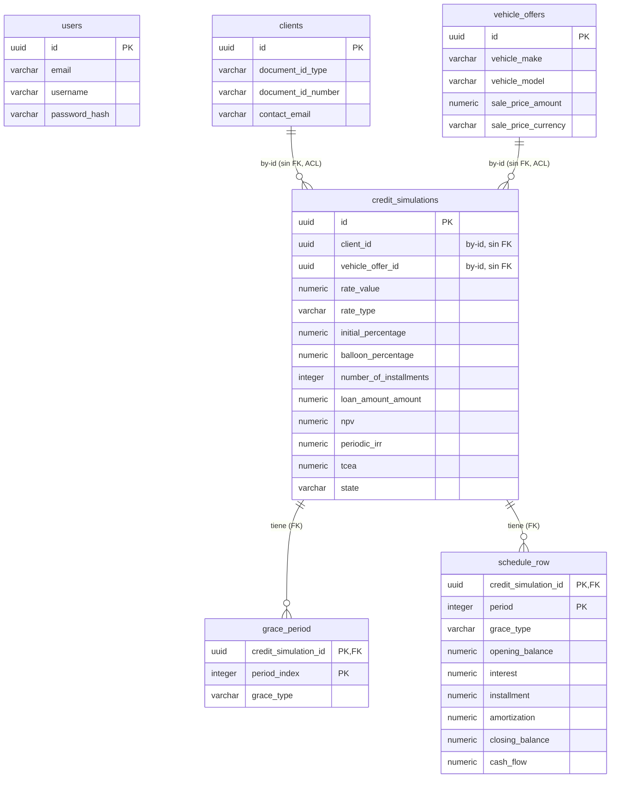

# Modelo de base de datos (entidad-relación)

> Modelo relacional para PostgreSQL: **mapeo tabla↔dominio**, **DDL** y **diagrama ER**. Deriva del
> modelo táctico [domain-model.md](../ddd/domain-model.md) y respeta la precisión del diccionario
> [analisis-de-datos.md](../report/analisis-de-datos.md). El diagrama ER también está en PlantUML en
> [database-er-diagram.puml](../diagrams/database-er-diagram.puml).

## Reglas de mapeo (DDD → JPA → PostgreSQL)

| Concepto DDD                  | Mapeo                                                                                                    |
|-------------------------------|----------------------------------------------------------------------------------------------------------|
| Raíz de agregado              | `@Entity` → tabla; identidad `@EmbeddedId` (VO tipado) → PK `uuid`.                                      |
| Value object escalar          | `@Embeddable` record → **columnas embebidas** en la tabla del dueño (Money = `*_amount` + `*_currency`). |
| Referencia a otro agregado    | id tipado `@Embedded` → **columna** (`client_id`) **sin FK** (frontera ACL).                             |
| Colección propia del agregado | `@ElementCollection` → **tabla hija** con FK real a la raíz (`ON DELETE CASCADE`).                       |
| Enum                          | `varchar` + `CHECK IN (...)` (`@Enumerated(STRING)`).                                                    |

## Mapeo tabla ↔ dominio

| Tabla                | Origen DDD                                    | Notas                                                                 |
|----------------------|-----------------------------------------------|-----------------------------------------------------------------------|
| `users`              | `User` (IAM, generic)                         | Credenciales mínimas.                                                 |
| `clients`            | `Client` (supporting)                         | VOs `DocumentId`, `ContactInfo` embebidos.                            |
| `vehicle_offers`     | `VehicleOffer` (supporting)                   | `Vehicle`, `SalePrice` (Money), `Plan` embebidos.                     |
| `credit_simulations` | `CreditSimulation` (core, raíz)               | VOs escalares embebidos; `client_id`/`vehicle_offer_id` by-id sin FK. |
| `grace_period`       | `GraceConfiguration.periods: List<GraceType>` | Tabla hija **ordenada** (`period_index`).                             |
| `schedule_row`       | `schedule: List<ScheduleRow>`                 | Tabla hija; PK `(credit_simulation_id, period)`.                      |

## Precisión (alineada con el diccionario de datos)

| Tipo de dato                                     | PostgreSQL       |
|--------------------------------------------------|------------------|
| Money (montos de salida)                         | `numeric(18,2)`  |
| Montos de precisión interna (`financed_balance`) | `numeric(18,12)` |
| Tasas / `tsd` / `cok`                            | `numeric(18,10)` |
| Porcentajes                                      | `numeric(18,6)`  |
| `tcea`                                           | `numeric(18,6)`  |
| `tir` (periodic_irr) y ecos de tasa              | `numeric(18,8)`  |
| Conteos / periodos                               | `integer`        |
| Identidad                                        | `uuid`           |

## DDL (PostgreSQL)

```sql
-- Identity & Access (generic)
CREATE TABLE users (
    id             uuid PRIMARY KEY,
    email          varchar(255) NOT NULL UNIQUE,
    username       varchar(100) NOT NULL UNIQUE,
    password_hash  varchar(255) NOT NULL,
    created_at     timestamptz  NOT NULL DEFAULT now(),
    updated_at     timestamptz  NOT NULL DEFAULT now()
);

-- Clients (supporting)
CREATE TABLE clients (
    id                  uuid PRIMARY KEY,
    document_id_type    varchar(10)  NOT NULL,          -- VO DocumentId
    document_id_number  varchar(20)  NOT NULL,
    contact_email       varchar(255),                   -- VO ContactInfo
    contact_phone       varchar(30),
    contact_address     varchar(255),
    created_at          timestamptz  NOT NULL DEFAULT now(),
    updated_at          timestamptz  NOT NULL DEFAULT now(),
    CONSTRAINT uq_clients_document UNIQUE (document_id_type, document_id_number)
);

-- Vehicle Offers (supporting)
CREATE TABLE vehicle_offers (
    id                   uuid PRIMARY KEY,
    vehicle_make         varchar(80)   NOT NULL,         -- VO Vehicle
    vehicle_model        varchar(80)   NOT NULL,
    vehicle_year         integer       NOT NULL,
    sale_price_amount    numeric(18,2) NOT NULL,         -- SalePrice = Money
    sale_price_currency  varchar(3)    NOT NULL,
    plan_name            varchar(40),                    -- VO Plan
    plan_installments    integer,
    created_at           timestamptz   NOT NULL DEFAULT now(),
    updated_at           timestamptz   NOT NULL DEFAULT now(),
    CONSTRAINT ck_offer_price_positive CHECK (sale_price_amount > 0),
    CONSTRAINT ck_offer_currency       CHECK (sale_price_currency IN ('PEN','USD'))
);

-- Credit Simulation (core, aggregate root)
CREATE TABLE credit_simulations (
    id                          uuid PRIMARY KEY,
    -- referencias by-id (SIN FK: frontera ACL)
    client_id                   uuid NOT NULL,
    vehicle_offer_id            uuid NOT NULL,
    -- Money: sale_price
    sale_price_amount           numeric(18,2)  NOT NULL,
    sale_price_currency         varchar(3)     NOT NULL,
    -- Rate
    rate_value                  numeric(18,10) NOT NULL,
    rate_type                   varchar(10)    NOT NULL,
    rate_capitalization         varchar(12),               -- obligatorio si NOMINAL (invariante de dominio)
    -- Percentages
    initial_percentage          numeric(18,6)  NOT NULL DEFAULT 0,
    balloon_percentage          numeric(18,6)  NOT NULL DEFAULT 0,
    -- Term
    number_of_installments      integer NOT NULL,
    frequency_days              integer NOT NULL DEFAULT 30,
    installments_per_year       integer NOT NULL DEFAULT 12,
    days_per_year               integer NOT NULL DEFAULT 360,
    -- InitialCosts
    notary_cost                 numeric(18,2)  NOT NULL DEFAULT 0,
    registry_cost               numeric(18,2)  NOT NULL DEFAULT 0,
    appraisal_cost              numeric(18,2)  NOT NULL DEFAULT 0,
    fees_cost                   numeric(18,2)  NOT NULL DEFAULT 0,
    -- PeriodicCosts
    credit_life_insurance_rate  numeric(18,10) NOT NULL DEFAULT 0,   -- TSD
    all_risk_insurance          numeric(18,2)  NOT NULL DEFAULT 0,   -- TSR
    gps                         numeric(18,2)  NOT NULL DEFAULT 0,
    shipping_fees               numeric(18,2)  NOT NULL DEFAULT 0,
    admin_fees                  numeric(18,2)  NOT NULL DEFAULT 0,
    -- Cost of capital (Rate)
    cost_of_capital             numeric(18,10) NOT NULL,
    -- Derived monetary results
    loan_amount_amount          numeric(18,2)  NOT NULL,
    loan_amount_currency        varchar(3)     NOT NULL,
    financed_balance_amount     numeric(18,12) NOT NULL,
    financed_balance_currency   varchar(3)     NOT NULL,
    -- Indicators
    npv                         numeric(18,2),
    periodic_irr                numeric(18,8),
    tcea                        numeric(18,6),
    effective_annual_rate       numeric(18,8),
    periodic_rate               numeric(18,8),
    periodic_cost_of_capital    numeric(18,8),
    -- State + concurrency + audit
    state                       varchar(12) NOT NULL DEFAULT 'DRAFT',
    version                     bigint      NOT NULL DEFAULT 0,        -- optimistic locking (@Version)
    created_at                  timestamptz NOT NULL DEFAULT now(),
    updated_at                  timestamptz NOT NULL DEFAULT now(),

    CONSTRAINT ck_sim_initial_pct CHECK (initial_percentage >= 0 AND initial_percentage < 1),
    CONSTRAINT ck_sim_balloon_pct CHECK (balloon_percentage >= 0 AND balloon_percentage < 1),
    CONSTRAINT ck_sim_pct_sum     CHECK (initial_percentage + balloon_percentage < 1),
    CONSTRAINT ck_sim_loan_pos    CHECK (loan_amount_amount > 0),
    CONSTRAINT ck_sim_sale_pos    CHECK (sale_price_amount > 0),
    CONSTRAINT ck_sim_n           CHECK (number_of_installments >= 1),
    CONSTRAINT ck_sim_freq        CHECK (frequency_days > 0),
    CONSTRAINT ck_sim_currency    CHECK (sale_price_currency IN ('PEN','USD')),
    CONSTRAINT ck_sim_rate_type   CHECK (rate_type IN ('NOMINAL','EFFECTIVE')),
    CONSTRAINT ck_sim_state       CHECK (state IN ('DRAFT','CONFIGURED','GENERATED','SAVED','REOPENED'))
);
CREATE INDEX ix_sim_client ON credit_simulations (client_id);   -- soporta findByClientId (historial, E7)

-- Grace configuration (tabla hija ordenada)
CREATE TABLE grace_period (
    credit_simulation_id  uuid    NOT NULL,
    period_index          integer NOT NULL,             -- @OrderColumn → preserva la secuencia S/T/P
    grace_type            varchar(10) NOT NULL,
    PRIMARY KEY (credit_simulation_id, period_index),
    CONSTRAINT fk_grace_sim FOREIGN KEY (credit_simulation_id)
        REFERENCES credit_simulations (id) ON DELETE CASCADE,
    CONSTRAINT ck_grace_type CHECK (grace_type IN ('NONE','TOTAL','PARTIAL'))
);

-- Schedule rows (tabla hija; cronograma persistido)
CREATE TABLE schedule_row (
    credit_simulation_id    uuid    NOT NULL,
    period                  integer NOT NULL,
    grace_type              varchar(10) NOT NULL,
    -- bloque del cuotón
    opening_balance_cuoton  numeric(18,2),
    interest_cuoton         numeric(18,2),
    closing_balance_cuoton  numeric(18,2),
    -- bloque de la cuota regular
    opening_balance         numeric(18,2),
    interest                numeric(18,2),
    installment             numeric(18,2),
    amortization            numeric(18,2),
    -- costos periódicos
    credit_life_insurance   numeric(18,2),
    all_risk_insurance      numeric(18,2),
    gps                     numeric(18,2),
    shipping_fees           numeric(18,2),
    admin_fees              numeric(18,2),
    closing_balance         numeric(18,2),
    cash_flow               numeric(18,2),
    PRIMARY KEY (credit_simulation_id, period),
    CONSTRAINT fk_schedule_sim FOREIGN KEY (credit_simulation_id)
        REFERENCES credit_simulations (id) ON DELETE CASCADE,
    CONSTRAINT ck_schedule_grace CHECK (grace_type IN ('NONE','TOTAL','PARTIAL'))
);
```

## Invariantes: base de datos vs dominio

| Invariante                                                                                            | Dónde                                       |
|-------------------------------------------------------------------------------------------------------|---------------------------------------------|
| `%CI∈[0,1)`, `%balloon∈[0,1)`, `%CI+%balloon<1`, `loan>0`, `sale>0`, `n≥1`, `frequency_days>0`, enums | **CHECK** en la base.                       |
| Capitalización obligatoria si `rate_type = NOMINAL`                                                   | **Dominio** (multi-columna condicional).    |
| Moneda única en toda la operación                                                                     | **Dominio** (cruza varias columnas/tablas). |
| Cuadre del cronograma (último saldo ≈ 0; `installment = interest + amortization`)                     | **Dominio** (lo garantiza el motor).        |

## Diagrama ER

FKs reales **intra-agregado** (`credit_simulations` → `schedule_row`, `grace_period`). Las relaciones
de `clients` y `vehicle_offers` con `credit_simulations` son **referencias by-id sin FK** (frontera
ACL); se dibujan con cardinalidad pero **no existe integridad referencial forzada** entre agregados.



> Nota: `users` (asesores, IAM) no tiene relación forzada con el resto; el registro de "quién creó la
> simulación" no se modela en v1.

## Nota: migraciones (Flyway) — Fase 5

El DDL de arriba es un **artefacto de documentación**. En la Fase 5 (código) se deriva un
`src/main/resources/db/migration/V1__init.sql` (Flyway), se añade la dependencia Flyway al `pom.xml` y
la **naming strategy snake_case** en el shared kernel. No se crea aún en esta fase.
