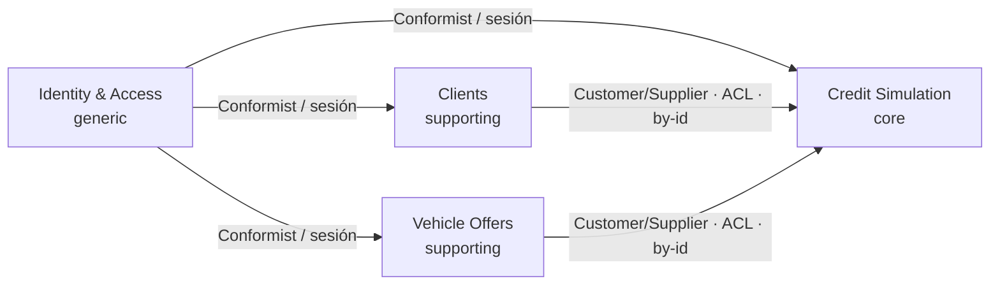

# Bounded contexts y mapa de contextos

> Decomposición estratégica: clasificación de subdominios, un **Bounded Context Canvas** por contexto
> y el **context map** con sus patrones de integración y relaciones de equipo (U/D). Basado en
> [domain_discovery.md](domain_discovery.md). Vocabulario en
> [lenguaje_ubicuo.md](../product/lenguaje_ubicuo.md).

## Clasificación de subdominios

| Contexto | Subdominio | Epics | Justificación (diferenciación × complejidad de modelo) |
|---|---|---|---|
| Identity & Access (IAM) | **generic** | E1 | Problema resuelto (login/sesión); se reusa, no se modela en profundidad. |
| Clients | **supporting** | E2 | Necesario pero no diferencia el negocio; CRUD simple. |
| Vehicle Offers | **supporting** | E3 | Necesario pero no diferencia; CRUD simple. |
| **Credit Simulation** | **core** | E4, E5, E6, E7 | **La ventaja del producto**: el motor de cronograma francés+balloon, gracia, costos e indicadores SBS. Aquí va el mejor esfuerzo de modelado. |

## Decisiones de frontera

### Clients y Vehicle Offers: contextos separados
Lenguaje y ciclo de vida distintos (persona/documento vs bien/precio); epics separados (E2/E3); el core
los referencia **por ID de forma independiente** (una misma oferta puede recotizarse para varios
clientes). No hay invariante compartido que justifique fusionarlos: serían dos modelos acoplados sin
razón.

### Indicators/Transparency: servicio de dominio del core, no contexto
VAN/TIR/TCEA se calculan sobre los flujos del **mismo** cronograma del agregado `CreditSimulation`, en
la **misma transacción** y con la **misma precisión**. Separarlos crearía un context map artificial
sobre datos que no cruzan frontera. Se modela como el servicio de dominio `IndicatorsCalculator`.

### Persistencia/Historial (E7): repositorio, no contexto
Guardar/reabrir/editar y el historial por cliente es el `CreditSimulationRepository` del agregado
(regla del playbook: "persistir/recuperar un agregado → Repository"). No es un bounded context.

---

## Bounded Context Canvas — Credit Simulation `core`

| Sección | Contenido |
|---|---|
| **Name** | Credit Simulation (alias de negocio: Simulación de Crédito / Plan de Pagos). |
| **Description** | Configura un financiamiento vehicular y genera su plan de pagos (método francés vencido + Compra Inteligente), con gracia y costos, calculando los indicadores de transparencia (VAN/TIR/TCEA) desde la óptica del deudor. |
| **Strategic Classification** | Domain: **core**. Business model: **compliance enforcer** (transparencia SBS) + generador de valor operativo. Evolution: **custom build**. |
| **Domain Roles** | Motor de cálculo ("analysis/engine"): transforma una configuración en un cronograma e indicadores. |
| **Inbound Communication** | `ConfigureFinancing`, `GenerateSimulation`, `SaveSimulation`, `ReopenSimulation`, `ReconfigureSimulation` (del asesor). |
| **Outbound Communication** | Queries **by-id** a Clients (validez del cliente) y a Vehicle Offers (precio de venta, moneda). |
| **Ubiquitous Language** | Préstamo, cuota regular, cuotón, gracia T/P/S, TEA/TEP, VAN/TIR/TCEA, flujo del periodo… (ver glosario, sección Credit Simulation). |
| **Business Decisions** | Invariantes: `initialPercentage + balloonPercentage < 1`; capitalización obligatoria si la tasa es nominal; `(totalGrace + partialGrace) < n`; moneda única; `loanAmount > 0`; el cronograma cuadra (último saldo ≈ 0). |

## Bounded Context Canvas — Clients `supporting`

| Sección | Contenido |
|---|---|
| **Name** | Clients. |
| **Description** | Registra y mantiene los datos del cliente (deudor) que la entidad usa en sus operaciones. |
| **Strategic Classification** | Domain: supporting. Evolution: custom/product. |
| **Inbound** | `RegisterClient`, `UpdateClient`; queries del core (validez por ID). |
| **Outbound** | — (no inicia colaboraciones). |
| **Ubiquitous Language** | Cliente/Deudor, documento de identidad, datos de contacto. |
| **Business Decisions** | Unicidad del documento de identidad; datos obligatorios mínimos. |

## Bounded Context Canvas — Vehicle Offers `supporting`

| Sección | Contenido |
|---|---|
| **Name** | Vehicle Offers. |
| **Description** | Registra y mantiene la oferta vehicular (vehículo, precio de venta, condiciones) base del financiamiento. |
| **Strategic Classification** | Domain: supporting. Evolution: custom/product. |
| **Inbound** | `RegisterVehicleOffer`, `UpdateVehicleOffer`; queries del core (precio/moneda por ID). |
| **Outbound** | — |
| **Ubiquitous Language** | Oferta vehicular, vehículo, precio de venta (PV), plan. |
| **Business Decisions** | Precio de venta `> 0`; moneda de la oferta. |

## Identity & Access (IAM) `generic`

Nota mínima (sin modelado táctico): provee `User` (email/username, password) y la **sesión** que
habilita operar. Se integra como **Conformist**: el negocio consume la identidad/sesión tal cual, sin
traducirla. Candidato a delegarse en un proveedor (p. ej. Spring Security). Se incluye solo como
referencia.

---

## Context map

| Upstream | Downstream | Patrón | Relación |
|---|---|---|---|
| Clients | Credit Simulation | **Customer/Supplier** + **ACL** en el core, referencia **by-id** | U/D (Clients upstream) |
| Vehicle Offers | Credit Simulation | **Customer/Supplier** + **ACL**, referencia **by-id** | U/D (Vehicle Offers upstream) |
| Identity & Access | Clients, Vehicle Offers, Credit Simulation | **Conformist** (sesión consumida tal cual) | U/D (IAM upstream) |

Notas:
- El core es **downstream** de Clients y Vehicle Offers, pero como **Customer** con peso: sus
  necesidades (precio de venta, moneda, validez del cliente) guían qué exponen los suppliers.
- El core mantiene un **Anti-Corruption Layer**: no importa los modelos `Client`/`VehicleOffer`; solo
  toma `ClientId`/`VehicleOfferId` + datos mínimos (`salePrice`, `currency`). Coincide con la regla del
  playbook "referenciar otros agregados solo por ID".
- **No** hay Shared Kernel de negocio: `Money`/`Currency` es un **kernel técnico** compartido (sin
  reglas de negocio). **No** hay Partnership ni Open Host Service público (API interna de la entidad).
