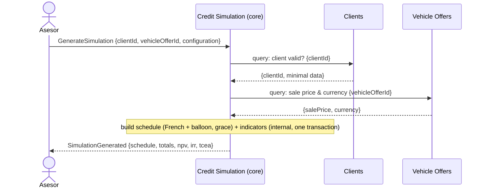

# Descubrimiento de dominio

> Descubrimiento del dominio con **EventStorming ligero** (eventos, comandos, políticas, read models,
> sistemas externos), agrupación en agregados, y un **Domain Message Flow** del escenario "generate
> simulation". Eventos en pasado, comandos en imperativo; identificadores del modelo en inglés.
> Insumo de [bounded-contexts.md](bounded-contexts.md) y [domain-model.md](domain-model.md).
> Vocabulario: [lenguaje-ubicuo.md](../product/lenguaje-ubicuo.md).

## Método

Se sigue el EventStorming del skill `ddd-playbook` en versión solo-analista: descubrir eventos de
dominio (algo que **ocurrió**, en pasado), los comandos que los disparan (en imperativo), las
políticas (un evento dispara automáticamente un comando), los read models (lo que un actor consulta
para decidir) y los sistemas externos; luego agrupar en **agregados** (un agregado recibe comandos y
produce eventos) y estos en **bounded contexts**.

## Línea de tiempo (happy path)

```text
AdvisorAuthenticated
  │  (pivote: IAM → negocio)
ClientRegistered ── VehicleOfferRegistered
  │  (pivote: registro → simulación)
FinancingConfigured → SimulationGenerated → ScheduleGenerated → BalloonSettled → IndicatorsCalculated
  │
SimulationSaved
```

Camino alterno (editar):

```text
SimulationReopened → SimulationReconfigured → ScheduleGenerated → IndicatorsCalculated → SimulationSaved
```

Los **puntos pivote** (cambios de fase) anticipan las fronteras de contexto: la barra IAM→negocio y la
barra registro→simulación.

## Eventos de dominio

| Evento                   | Contexto          | Disparado por (comando)        |
|--------------------------|-------------------|--------------------------------|
| `AdvisorAuthenticated`   | Identity & Access | `Authenticate`                 |
| `ClientRegistered`       | Clients           | `RegisterClient`               |
| `ClientUpdated`          | Clients           | `UpdateClient`                 |
| `VehicleOfferRegistered` | Vehicle Offers    | `RegisterVehicleOffer`         |
| `VehicleOfferUpdated`    | Vehicle Offers    | `UpdateVehicleOffer`           |
| `FinancingConfigured`    | Credit Simulation | `ConfigureFinancing`           |
| `SimulationGenerated`    | Credit Simulation | `GenerateSimulation`           |
| `ScheduleGenerated`      | Credit Simulation | `GenerateSimulation` (interno) |
| `BalloonSettled`         | Credit Simulation | `GenerateSimulation` (interno) |
| `IndicatorsCalculated`   | Credit Simulation | `GenerateSimulation` (interno) |
| `SimulationSaved`        | Credit Simulation | `SaveSimulation`               |
| `SimulationReopened`     | Credit Simulation | `ReopenSimulation`             |
| `SimulationReconfigured` | Credit Simulation | `ReconfigureSimulation`        |

## Comandos

| Comando                                       | Actor  | Agregado destino   | Evento(s) producido(s)                                                               |
|-----------------------------------------------|--------|--------------------|--------------------------------------------------------------------------------------|
| `Authenticate`                                | Asesor | `User`             | `AdvisorAuthenticated`                                                               |
| `RegisterClient` / `UpdateClient`             | Asesor | `Client`           | `ClientRegistered` / `ClientUpdated`                                                 |
| `RegisterVehicleOffer` / `UpdateVehicleOffer` | Asesor | `VehicleOffer`     | `VehicleOfferRegistered` / `VehicleOfferUpdated`                                     |
| `ConfigureFinancing`                          | Asesor | `CreditSimulation` | `FinancingConfigured`                                                                |
| `GenerateSimulation`                          | Asesor | `CreditSimulation` | `SimulationGenerated`, `ScheduleGenerated`, `BalloonSettled`, `IndicatorsCalculated` |
| `SaveSimulation`                              | Asesor | `CreditSimulation` | `SimulationSaved`                                                                    |
| `ReopenSimulation` / `ReconfigureSimulation`  | Asesor | `CreditSimulation` | `SimulationReopened` / `SimulationReconfigured`                                      |

## Políticas (event → command)

| Política                                                               | Naturaleza                                                         |
|------------------------------------------------------------------------|--------------------------------------------------------------------|
| Cuando `ScheduleGenerated` ⇒ calcular indicadores                      | **Interna al agregado**, síncrona (parte de `GenerateSimulation`). |
| Cuando `BalloonSettled` ⇒ incluir la fila de liquidación en los flujos | **Interna**, síncrona.                                             |

> **Honestidad de modelado:** el motor de cálculo es **síncrono dentro de un único agregado**. No hay
> políticas que crucen fronteras de contexto ni eventual consistency entre agregados. Documentarlo así
> evita introducir domain events innecesarios (anti-patrón). Ver
> [domain-model.md](domain-model.md#domain-events).

## Read models

| Read model                                      | Quién lo consulta | Para decidir                                   |
|-------------------------------------------------|-------------------|------------------------------------------------|
| Lista de clientes                               | Asesor            | A qué cliente asociar la operación.            |
| Lista de ofertas vehiculares                    | Asesor            | Qué oferta financiar.                          |
| Cronograma + panel de indicadores/transparencia | Asesor            | Evaluar la conveniencia y mostrarla al deudor. |
| Historial de simulaciones por cliente           | Asesor            | Revisar operaciones anteriores.                |

## Sistemas externos

| Sistema externo     | Estado en v1                                |
|---------------------|---------------------------------------------|
| Tipo de cambio (FX) | **Ausente** (mono-divisa, sin conversión).  |
| Pasarela de pagos   | **Ausente** (sin originación/pagos reales). |
| Scoring crediticio  | **Ausente**.                                |

> El **vacío deliberado** de sistemas externos es un hallazgo: confirma que el límite de alcance de
> Fase 1 (sin FX, sin pagos, sin scoring) se sostiene en el modelo. IAM es interno.

## Agregados candidatos

Agrupando comandos+eventos (un agregado recibe comandos y produce eventos):

| Agregado           | Recibe                                                                                                    | Produce                                                                                                    |
|--------------------|-----------------------------------------------------------------------------------------------------------|------------------------------------------------------------------------------------------------------------|
| `User` (IAM)       | `Authenticate`                                                                                            | `AdvisorAuthenticated`                                                                                     |
| `Client`           | `RegisterClient`, `UpdateClient`                                                                          | `ClientRegistered`, `ClientUpdated`                                                                        |
| `VehicleOffer`     | `RegisterVehicleOffer`, `UpdateVehicleOffer`                                                              | `VehicleOfferRegistered`, `VehicleOfferUpdated`                                                            |
| `CreditSimulation` | `ConfigureFinancing`, `GenerateSimulation`, `SaveSimulation`, `ReopenSimulation`, `ReconfigureSimulation` | `SimulationGenerated`, `ScheduleGenerated`, `BalloonSettled`, `IndicatorsCalculated`, `SimulationSaved`, … |

`CreditSimulation` concentra configuración + cronograma + indicadores en **un solo agregado** porque el
**cuadre** (saldo final ≈ 0, `installment = interest + amortization`, cuotón liquidado) es una
invariante que abarca todas las filas y debe valer dentro de **una transacción**.

## Contextos candidatos

| Agregados          | Contexto candidato | Subdominio |
|--------------------|--------------------|------------|
| `User`             | Identity & Access  | generic    |
| `Client`           | Clients            | supporting |
| `VehicleOffer`     | Vehicle Offers     | supporting |
| `CreditSimulation` | Credit Simulation  | **core**   |

El detalle (canvases, context map) está en [bounded-contexts.md](bounded-contexts.md).

## Domain Message Flow — escenario "generate simulation"

Mensajes (commands/queries/events) entre el asesor y los contextos. Las consultas a Clients y
VehicleOffers son **by-id** (no comparten modelo) — base del ACL del context map.


